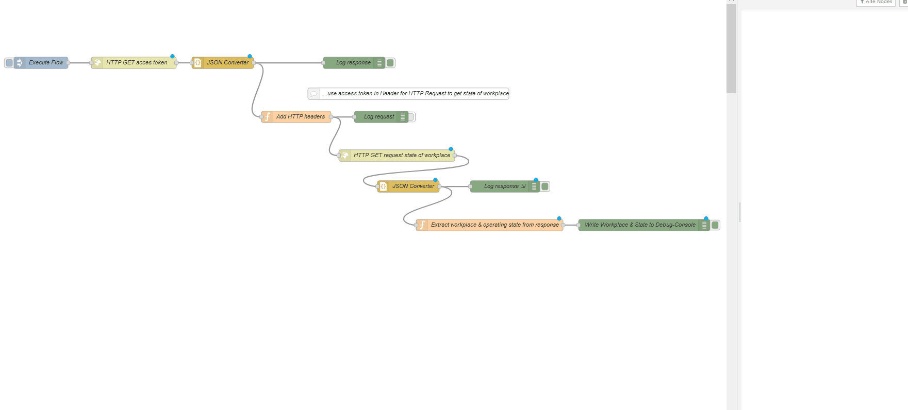

# samples-node-red
Provides sample applications for using the FORCAM FORCE Bridge API with Node-Red.
If you have any questions look at https://forcebridge.io/en/qa-portal/

### Useful Links

* Website: https://www.forcebridge.io/ | https://www.forcam.com/
* Documentation: https://forcebridge.io/en/developers/
* API Definition: https://app.swaggerhub.com/apis-docs/FORCAM/FORCEBridgeAPI/
### Usage / Requirements

###### Access to a FORCAM FORCE Bridge API System

_If you need access to a demo system please contact forcebridge@forcam.com._

Please add your URL, user and password of your Bridge API instance to the variables below (contained by all samples).

```Javascript

"https://forcebridgehackathon.force.eco:25443/ffauth/oauth2.0/accessToken?client_id=" + Username +"&client_secret="+ Password + "&grant_type=client_credentials&scope=read%20write"
```

###### Framework & Tool

* Node-Red Tool (https://nodered.org/#get-started)

### Description of the sample applications:

# Authentication

A small Node-Red application wich authenticates to a FORCAM FORCE Bridge API and prints out the token information.


File: "GetTokenFlow.json".

# Get all available workplaces

A small Node-Red application wich authenticates to a FORCAM FORCE Bridge API, determine all available workplaces and prints them out.


File: "GetAllWorkplacesFlow.json".

# Get current operating state of a workplace

A small Node-Red application wich authenticates to a FORCAM FORCE Bridge API, determine the operating state of an workplace and print it.



File: "GetCurrentStateofWorkplaceFlow.json".

# Get all operating states

A small Node-Red application wich authenticates to a FORCAM FORCE Bridge API, determine all operating states and prints them out.


File: "GetAllOperatingStatesFlow.json ".
