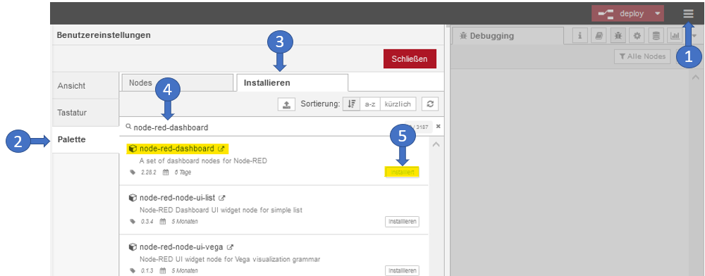

# samples-node-red
Provides sample applications for using the FORCAM FORCE Bridge API with Node-Red.
If you have any questions look at https://forcebridge.io/en/qa-portal/

### Useful Links

* Website: https://www.forcebridge.io/ | https://www.forcam.com/
* Documentation: https://forcebridge.io/en/developers/
* API Definition: https://app.swaggerhub.com/apis-docs/FORCAM/FORCEBridgeAPI/

### Usage / Requirements

###### Framework & Tools

* Node-Red Tool (https://nodered.org/#get-started)
* Dashboard 
    - Steps for installing ( see below  (1) Go to Hamburger-Menu  (2) Manage palette  (3) Tab "Install"  (4) Search after "Node-Red-Dashboard"  (5) Click install)



###### Access to a FORCAM FORCE Bridge API System

_If you need access to a demo system please contact forcebridge@forcam.com._

Please add your URL to the Node "HTTP GET access token", and replace the Username and Password (in the picture marked as "GitHub" ) with your user and password of your Bridge API instance (contained by all sample-flows).

```Javascript

"https://forcebridgehackathon.force.eco:25443/ffauth/oauth2.0/accessToken?client_id=" + Username + "&client_secret=" + Password + "&grant_type=client_credentials&scope=read%20write"
```


### How to Import sample-flows

1. Clone Repository or download files
2. Open Node-Red
3. Open Hamburger-Menu
4. Click on Import
5. Press Button "select a file to import"
6. Choose your flow to import
7. Deploy the flow and execute

### Description of the sample applications:

# Authentication

A small Node-Red application wich authenticates to a FORCAM FORCE Bridge API and prints out the token information.


File: "GetTokenFlow.json".

# Get all available workplaces

A small Node-Red application wich authenticates to a FORCAM FORCE Bridge API, determine all available workplaces and prints them out.


File: "GetAllWorkplacesFlow.json".

# Get current operating state of a workplace

A small Node-Red application wich authenticates to a FORCAM FORCE Bridge API, determine the operating state of an workplace and print it.


File: "GetCurrentStateofWorkplaceFlow.json".

# Get all operating states

A small Node-Red application wich authenticates to a FORCAM FORCE Bridge API, determine all operating states and prints them out.


File: "GetAllOperatingStatesFlow.json ".
